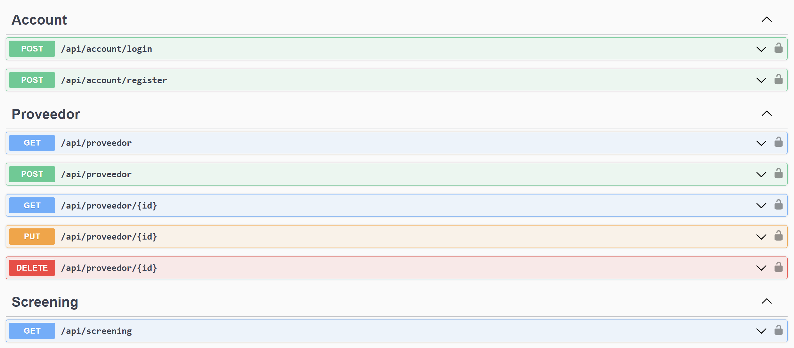
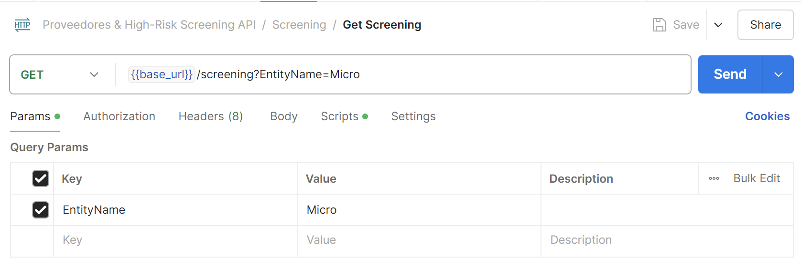
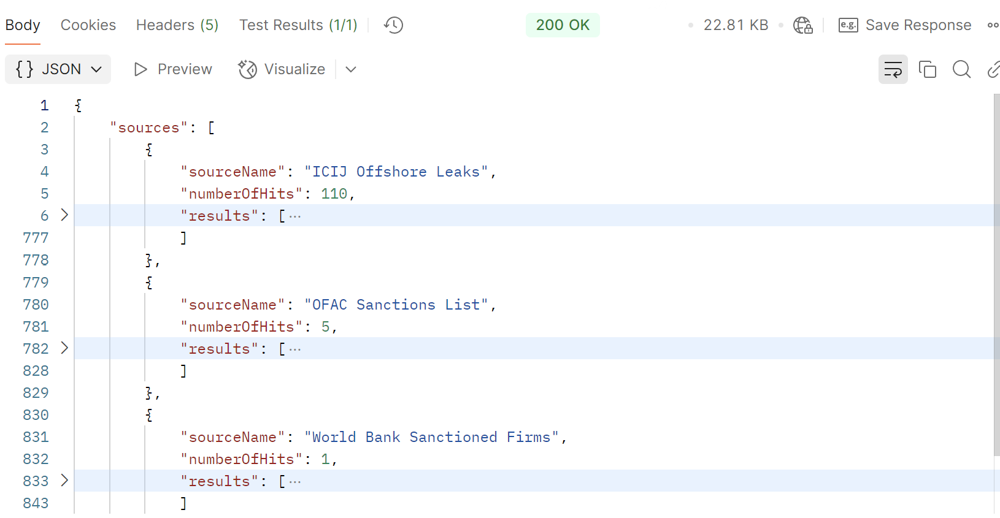
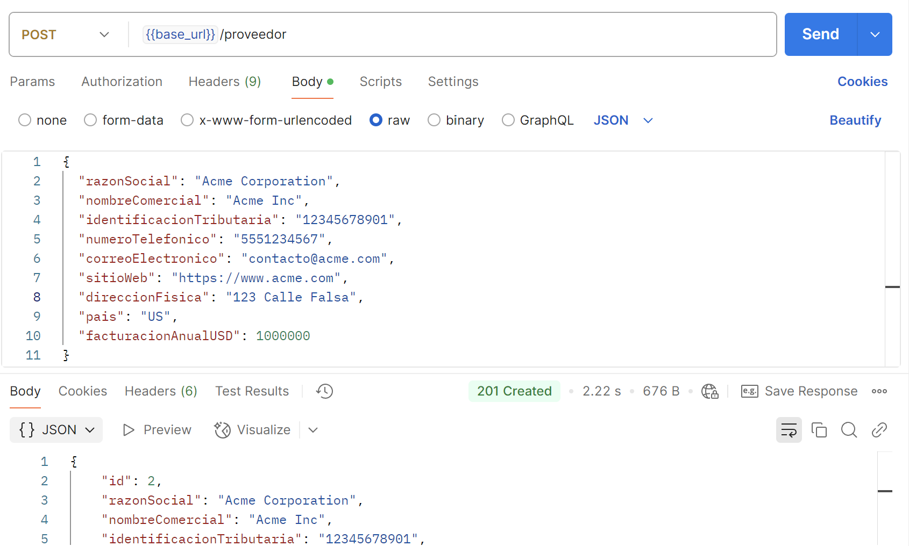
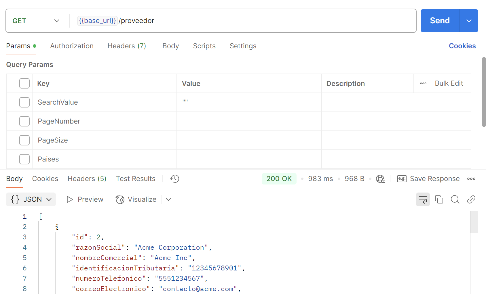

# **Prueba Técnica .NET Developer EY - Back-End**
Este repositorio contiene la implementación de la prueba técnica para el puesto de Fullstack Jr, la cual se divide en dos ejercicios principales:

1. **Web Scraping para búsqueda en listas de alto riesgo (Ejercicio 1)**: Un servicio REST API desarrollado en .NET 8.0 que realiza web scraping en fuentes oficiales para identificar entidades en listas de alto riesgo. Permite consultar mediante un endpoint REST, devolviendo los resultados encontrados de manera estructurada.

2. **Aplicación web para Debida Diligencia de Proveedores (Ejercicio 2)**: Un Web API en .NET 8.0 que proporciona funcionalidades CRUD para gestionar un inventario de proveedores y realizar un cruce con las listas de alto riesgo obtenidas en el ejercicio 1. La API incluye autenticación JWT, validaciones de seguridad y documentación interactiva con Swagger.

El objetivo de este repositorio es ofrecer una solución integral para automatizar las tareas de búsqueda de entidades de riesgo y gestionar el análisis de proveedores de manera eficiente.

# **Instrucciones para Desplegar la Solución (Back-End)**

## **Requisitos Previos**
- **.NET SDK 8.0.204**: Descargar e instalar desde [sitio oficial de .NET](https://dotnet.microsoft.com/).
- **SQL Server**: Tener una instancia de SQL Server en ejecución.
- **Postman**: Para probar los endpoints del REST API.
- **Git**: Para clonar el repositorio.

---

## **Configuración Inicial**

1. **Clonar el repositorio**
   ```bash
   git clone https://github.com/Danielrp551/PRUEBA_TECNICA_EY.git
   cd PRUEBA_TECNICA_EY
   ```

2. **Restaurar dependencias NuGet**
   ```bash
   dotnet restore
   ```

3. **Configuración de la base de datos**
   - Edita el archivo `appsettings.json` con la cadena de conexión:
     ```json
     "ConnectionStrings": {
       "DefaultConnection": "Server=<TU_SERVIDOR>;Database=<NOMBRE_BD>;User Id=<USUARIO>;Password=<CONTRASEÑA>;"
     }
     ```

4. **Ejecutar las migraciones de la base de datos** (si corresponde):
   ```bash
   dotnet ef database update
   ```

---

## **Paquetes NuGet Utilizados**

## **Paquetes por defecto del proyecto webapi
- `Swashbuckle.AspNetCore - 6.4.0` (Swagger para documentación de la API)
- `Microsoft.AspNetCore.OpenApi - 8.0.4`

### **Ejercicio 1 (Web Scraping)**
- `Selenium.WebDriver - 4.27.0`
- `Selenium.WebDriver.ChromeDriver - 132.0.6834.8300-beta`
- `HtmlAgilityPack.NetCore - 1.5.0.1`

### **Ejercicio 2 (Debida Diligencia de Proveedores)**
- `Microsoft.AspNetCore.Authentication.JwtBearer - 8.0.11`
- `Microsoft.AspNetCore.Identity.EntityFrameworkCore - 8.0.11`
- `Microsoft.AspNetCore.Mvc.NewtonsoftJson - 8.0.11`
- `Microsoft.EntityFrameworkCore.Design - 9.0.0`
- `Microsoft.EntityFrameworkCore.SqlServer - 9.0.0`
- `Microsoft.EntityFrameworkCore.Tools - 9.0.0`
- `Microsoft.Extensions.Identity.Core - 9.0.0`
- `Newtonsoft.Json - 13.0.3`
---

## **Ejecución del Proyecto**

1. **Iniciar la aplicación**
   ```bash
   dotnet run
   ```
   - La API estará disponible en: `http://localhost:5000` (o el puerto configurado, lo pueede ver en la consola al ejecutar el comando dotnet run).

2. **Swagger UI**:
   - Accede a `http://localhost:5000/swagger/index.html` para visualizar y probar los endpoints.

---

## **Despliegue**

### **Despliegue Local (IIS)**
1. Publica el proyecto:
   ```bash
   dotnet publish --configuration Release
   ```
2. **IIS**:
   - Crea un nuevo sitio apuntando al directorio `publish`.
   - Configura el puerto y habilita el framework .NET en IIS.

---

## **Colección Postman**
- La colección Postman se encuentra en `docs/postman_collection.json`.
- Importa el archivo en Postman para probar los endpoints preconfigurados.

---

## **Notas Adicionales**
- No es necesario instalar manualmente el **ChromeDriver**; se descargará automáticamente al restaurar las dependencias NuGet.
- Asegúrate de que tu instancia de SQL Server permita conexiones remotas si el despliegue es en un entorno distinto al local.

## **Vista de Swagger**
Este es un ejemplo de cómo se visualizan los endpoints en Swagger:


## **Ejemplo de Solicitud en Postman**
Ejemplo de solicitud en Postman para el endpoint de web scraping:


## **Resultado de Web Scraping (Ejercicio 1)**
Resultado de búsqueda de una entidad en las listas de alto riesgo:


## **CRUD de Proveedores (Ejercicio 2)**
### **Ejemplo de Creación de Proveedor (POST)**
Este es un ejemplo de cómo se ve la solicitud para crear un nuevo proveedor y la respuesta exitosa:


### **Ejemplo de Listado de Proveedores (GET)**
A continuación se muestra el resultado al listar los proveedores:


---
